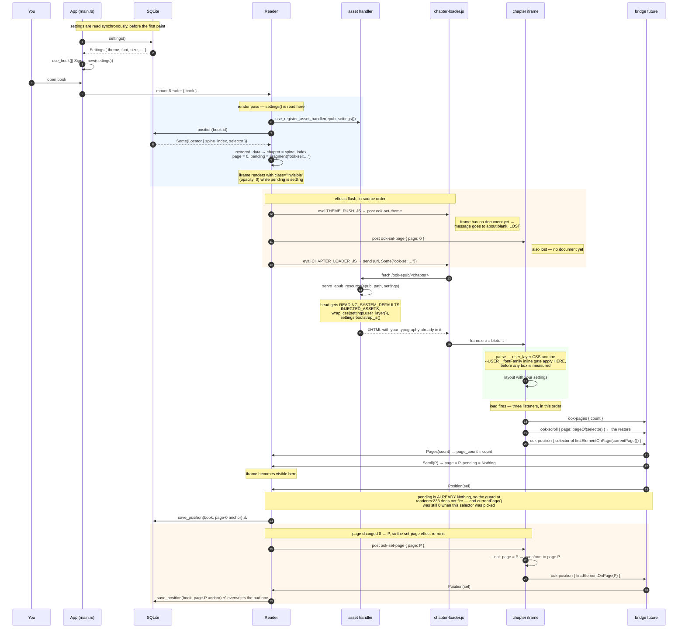
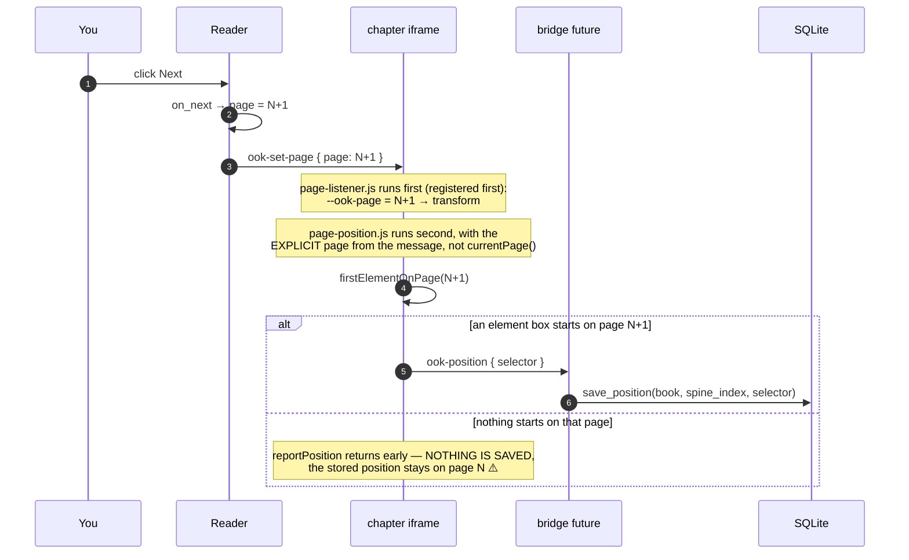

# Position across a reflow — why restore landed a page behind

[← Reading Position](README.md) · rework, 1 of 1

Drafted 2026-08-10 while dogfooding
[Phase 4](../../03-reader-enhancements/04-themes-typography/phase-4-theming.md).
**Status: implemented**, 98 tests green — commit pending. See
[What landed](#what-landed) for the shipped code and
[Still open](#still-open) for what it did not fix.

Filed here rather than under Themes & Typography, where the work happened, because the
feature it repairs is this one: the cause is late font loading, but the deliverable is
*reopen lands where you stopped*. Same rule Phase 4 applied to the rendering bug it
surfaced.

Written to answer one question: *when a book opens one page behind where I stopped, is
that because the settings land after the position has already been restored?* The answer
turned out to be no, and chasing it properly turned up two more bugs of the same shape —
hence the title. Every layout change needs a re-anchor, and **the anchor has to predate
the change**. Three bugs here are that sentence being violated three different ways.

Short answer up front, then the diagrams that justify it:

> **No — not on a cold open.** Typography and theme are baked into the chapter document
> *before* it is parsed, so every measurement the restore does is already made with your
> settings in force. The push over `theme-push.js` that happens around the same time is a
> no-op on a cold open (it is aimed at a frame with no document yet, and it carries the
> same values that are already in the CSS).
>
> The ordering problem that *does* exist on a cold open is a different one: the iframe
> reports a **reading position for page 0** before the restored page has been applied, and
> that write lands in SQLite. See [Defect A](#defect-a-the-load-time-position-write).

## Cast

| Participant | Where |
| --- | --- |
| `App` | `src/main.rs:38` — owns the `Signal<Settings>` and the `Library` |
| `Db` | `src/db/settings.rs`, `src/db/positions.rs` — one SQLite file |
| `Reader` | `src/ui/reader.rs:48` — the component, its three `use_effect`s and the bridge future |
| `handler` | `epub::use_register_asset_handler` (`src/epub.rs:225`) — serves `/ook-epub/…` |
| `loader` | `chapter-loader.js`, running in the **outer** webview |
| `bridge` | `ook-events-listener.js`, also outer — forwards `postMessage` → `dioxus.send` |
| `chapter` | the **inner** iframe document, with `INJECTED_ASSETS` in its head |

`INJECTED_ASSETS` (`src/web/assets.rs:22`) is concatenated in a fixed order, and that order
*is* the `load`-listener firing order inside the chapter:

```
pagination.css → page-geometry → page-listener → link-bridge
              → page-count      → fragment-scroll → page-position → theme-listener
```

So on `load`: **page count first, then the fragment scroll, then the position report.**

---

## 1. Cold open — launch, then open a book with a stored position



### What this diagram settles

* **Settings are never "late" here.** They travel two ways, and the one that matters is the
  synchronous one: `serve_epub_resource` (`src/epub.rs:59-63`) inlines
  `settings.user_layer()` and `settings.bootstrap_js()` into the chapter's `<head>`. Parse
  order guarantees the font size, line height, measure and margins are in the cascade
  before the first box is laid out — and therefore before `pageOf` divides anything.
* **The `theme-push.js` message on a cold open is dead.** It is evaluated in the first
  effect flush, which is *before* the loader effect sets `frame.src`. There is no document
  to receive it. That is harmless only because the CSS path above already covers it.
* **`--ook-page` starts at 0** (`pagination.css`), and nothing tells the chapter the
  restored page until Dioxus reacts to `ook-scroll`. That gap is where Defect A lives.

---

## 2. Steady state — turning a page and saving



This is the only path that writes a position during normal reading. Note there is **no
save on unmount and no save on quit** — whatever the last `ook-position` said is what you
get next time.

---

## 3. Changing a setting while the book is open

```mermaid
sequenceDiagram
    autonumber
    participant U as You
    participant App as App
    participant R as Reader
    participant C as chapter iframe
    participant B as bridge future
    participant Db as SQLite

    U->>App: SettingsPopover → settings.write()
    App->>Db: save_settings (App's use_effect, main.rs:65)
    Note over R: Reader re-renders — it read settings() during render
    R->>R: use_register_asset_handler re-registers<br/>(use_callback keeps the closure current,<br/>so later fetches get the NEW settings)
    R->>C: THEME_PUSH_JS → ook-set-theme { vars }

    rect rgb(240,255,240)
    Note over C: theme-listener.js — this is the reflow-safe path
    C->>C: before = currentPage(); anchor = firstElementOnPage(before)
    C->>C: apply/remove each var on documentElement
    C->>C: report() → ook-pages
    C->>C: page = pageOf(document.querySelector(anchor))
    alt the anchor moved
        C->>B: ook-reflow { page }
        B->>R: Reflow(page) → page = page
    end
    end
```

Two things worth noticing about this path:

* It is the **only** thing that re-anchors after a layout change. It runs on a theme push
  and nothing else — not on `resize` (`page-count.js` re-reports the *count* on resize, but
  nobody re-derives the *page*), and not on a chapter load.
* The pushed vars are inline styles on `documentElement`; the served CSS puts the same
  values on `:root`. On a cold open they agree exactly, which is why step 1's lost push
  costs nothing.

---

## What the trace actually showed (2026-08-10, book 28, spine 7)

Two consecutive runs, byte-identical. The decisive lines are these three, **all stamped
13:23:42, with no user input anywhere between them**:

```
fragment resolved   page=3 at=3.26 <p>   ook-sel:body > div:nth-child(1) > p:nth-child(57)
position[load]      page=0 at=0.26 <div>         body > div:nth-child(1)
position[set-page]  page=3 at=3.24 <p>           body > div:nth-child(1) > p:nth-child(44)
```

Both `load` measurements report a pad fraction of **0.26**. The very next line — the Rust
`ook-set-page` round trip, milliseconds later — reports **0.24**. The chapter reflows
immediately after `load`, before anything else happens, and nothing re-measures the restore.

The cross-interaction pair says the same thing at larger scale: `p:nth-child(57)` reads
`at=3.26` at `load` and `at=4.24` at 13:23:47, after a manual page turn. The page turn is
not what moved it — `at` is `offsetLeft / innerWidth`, and turning a page only writes
`--ook-page`, which drives a `transform`; `offsetLeft` is a layout value and ignores
transforms. The element genuinely moved from column 3 to column 4.

That is the whole bug:

* you stop on page 4 — the anchor is filed post-reflow, correctly;
* on reopen `reportFragmentPage` measures that selector at `load`, **pre-reflow**, gets
  page 3, and `on_scroll(3)` commits it;
* the reflow then happens, but the only thing that re-anchors after a layout change is
  `theme-listener.js`, and it only runs on a theme push. No `reflow` line appears in the
  trace. So page 3 stands.

The geometry moves too, not just the content. `pad/W` goes `0.26 → 0.24`, so `C/W` goes
`0.48 → 0.52`. The column is pinned by the `70ch` measure cap, so **the viewport shrank**
after `load` — and content shifting *forward* by a full column on top of a narrower
viewport means the column also got **shorter**. The iframe is being resized after the
chapter has already been measured.

### What this rules out

* **Defect B** — not it. The save happened; `p:nth-child(57)` is in the DB.
* **Defect C** — not it. The fractions are `.26`/`.24`, nowhere near a rounding boundary.
* **Defect A** — real, but self-healing and not the cause. The trace shows it plainly:
  `save … selector=body > div:nth-child(1)` is the page-0 write, overwritten a beat later
  by the `p:nth-child(44)` save. Still worth closing.
* **"Settings land after the restore"** — half right, and worth being precise about. The
  *values* are in the served CSS before parse, exactly as diagram 1 says. But the geometry
  they imply (`--ook-column`, and therefore how much text fits in a column) is not final
  when `fragment-scroll.js` measures. The restore is racing the layout, not the settings.

### Root cause — confirmed

The `ookGeom()` stamps settle it. Across the reflow, on two identical runs:

| | at `load` | after |
| --- | --- | --- |
| `w` / `h` | 1728 / 928 | 1728 / 928 |
| `fs` / `lh` | 24px / 33.6px | 24px / 33.6px |
| `ff` | PTSerif | PTSerif |
| **`col`** | **840px** | **895.44px** |

Nothing is resized. `col` is `--ook-column`, which is the `70ch` measure cap, so `ch` went
`12px → 12.792px` with the `font-family` and `font-size` *declarations* unchanged. The only
thing that moves `ch` under those conditions is **which actual font file resolves the
metrics** — a font load completing. The pad fractions corroborate exactly:
`(1728−840)/2/1728 = 0.257` → `at=…26`, and `(1728−895.44)/2/1728 = 0.241` → `at=…24`.

> **The book's embedded `@font-face` font loads after the `load` event.** The `load` event
> does not wait for CSS font loading — WebKit lays out with fallback metrics, fires `load`,
> then swaps. `fragment-scroll.js` measures inside that window, reports page 3, and Rust
> commits it. The swap then reflows the chapter, and the only thing that re-anchors after a
> layout change is `theme-listener.js`, which only runs on a theme push.

Note the direction, which is counterintuitive: the column got **wider** and yet content
moved **forward**. `70ch` pins characters-per-line only if letter widths scale with the
digit width, and across two different fonts they do not. PTSerif's `0` is 6.6% wider than
the fallback's, but its letters are proportionally wider still, so 70ch holds fewer real
characters → more lines → content pushed forward. `sw` moving `11652 → 11680` agrees.

### Why this hits the default setting specifically

`FontFamily::Publisher` is the default, and its `stack()` is `""` — so `bootstrap_js`
writes nothing, the `:root[style*='--USER__fontFamily']` gate never matches, and the book's
**own** embedded fonts render. Those are fetched through the asset handler and load
asynchronously. Choosing any other family gates in a system stack, which resolves
synchronously and makes the bug vanish — which is also the cheapest way to confirm the
diagnosis without touching code.

## The candidates, as originally ranked

Kept for the record; the trace above has since settled which one it is.

### Defect A: the load-time position write

`page-position.js:43` — `window.addEventListener("load", () => reportPosition(currentPage()))`.

At that moment `--ook-page` is still `0`, because the `ook-set-page` carrying the restored
page was posted to a frame that did not exist yet (diagram 1, step 12). So the chapter
reports the anchor of **page 0**, and on the Rust side `pending` has already been cleared
by the `ook-scroll` that arrived one message earlier — so the `is_settling` guard at
`src/ui/reader.rs:233` does not stop it, and `save_position` runs.

It is normally repaired a beat later by the `set-page P` round trip. It is *not* repaired
if `firstElementOnPage(P)` returns `null` (see Defect B), or if you close the book inside
that window. When it isn't repaired you land at the **top of the chapter**, not one page
back — so this alone doesn't explain your symptom, but it is a genuine bug and it makes
the other two harder to reason about.

### Defect B: a page with no element box on it saves nothing

`firstElementOnPage` (`page-position.js:24`) walks `document.body.getElementsByTagName("*")`
and returns the first element whose `pageOf` matches. If a page is entirely the middle of
one long paragraph with no inline markup, nothing matches, `reportPosition` returns early,
and **the stored position is never advanced past the previous page**. Reopen and you are
exactly one page behind. This fits the symptom precisely; how often it fires depends on
your font size and the book's markup.

### Defect C: `Math.round` in `pageOf` claims inline elements early

`pageOf` is `Math.round(el.offsetLeft / window.innerWidth)` (`page-geometry.js:1`).

With the geometry in `pagination.css`, column *k* starts at `k·100vw + (100vw − C)/2`, so a
**block** element always rounds to *k* — that part is safe, and it is what the
`the_page_geometry_derives_from_one_column_width` test protects. But an **inline** element
(`<em>`, `<a>`, `<span>`) sits at `column start + x`, and it rounds up to *k+1* as soon as
`x ≥ C/2` — i.e. anything in the right half of a column is attributed to the next page.

Because `firstElementOnPage` scans in document order, the anchor it picks for page *P* can
therefore be an inline element that is visually on page *P−1*. Save and restore use the
same formula, so this is self-consistent across a restart at identical layout — but it
stops being self-consistent the moment the layout differs even slightly (a settings change
between sessions, a different window size), and then the error is exactly one page.

### Not the cause

* Stale settings in the asset handler. `use_asset_handler` wraps the closure in
  `use_callback` (`dioxus-desktop-0.7.9/src/hooks.rs:97`), so the handler always serves the
  current `Settings`.
* ~~Web-font loading shifting text after `load`. Every stack in `src/web/font.rs` is system
  fonts only — nothing loads asynchronously.~~ **Wrong, and this was the cause.** The
  stacks in `font.rs` are indeed all system fonts, but `Publisher` — the default — has an
  empty stack precisely so the *book's* embedded fonts apply, and those do load
  asynchronously. Checking the stacks was not the same as asking what happens when the
  feature is deliberately off.
* The `invisible` class hiding the frame during settling. It is `opacity: 0`
  (`assets/main.css:15`), so layout and `innerWidth` are unaffected.

---

## The fixes — a sketch

> **Status: all four implemented** (2026-08-10). See [What landed](#what-landed) at the
> end for how the shipped code differs from this sketch. The sketch is kept as written
> because the reasoning is the point; the differences are small and called out there.

Four steps, smallest and most independent first. Each step leads with the check that makes
it visible.

There is a structural point running through all of it. Right now three files each register
their own `load` listener, and **their relative order is an emergent property of the
`concat!` order in `assets.rs`** — that is why the ordering table earlier in this document
had to exist at all. Step 2 collapses those three into one explicit sequence, which is what
makes the ordering a thing you can read instead of a thing you have to reconstruct.

### Step 1 — stop the page-0 write (Defect A)

Independent of the font bug; do it first because it is small and it de-noises every trace
after it.

`page-position.js` reports on `load` using `currentPage()`, which is `0` because the
restored page has not round-tripped yet. But that load report is not useless — it is what
records "you are at the top of chapter 8" after a chapter advance, where the Rust page is
already `0` and no `ook-set-page` ever fires. So it cannot simply be deleted.

The iframe already knows whether a restore is in flight: a non-empty `location.hash`.

```js
window.addEventListener("load", () => {
  if (location.hash) return;      // a restore is coming; its set-page will report
  reportPosition(currentPage(), "load");
});
```

**Check:** open book 28 and watch the trace. The line
`save … selector=body > div:nth-child(1)` must be gone, and the first `save` of the session
must be the `p:nth-child(44)` one.

**Edge case to decide:** when the hash is present but `UNRESOLVED`, `on_scroll` leaves the
page at `0`, no `set-page` fires, and now nothing reports a position at all. Either report
from the unresolved branch of `reportFragmentPage`, or accept it.

### Step 2 — measure after the fonts settle (the actual bug)

`document.fonts.ready` resolves once font loading *and* the layout it invalidates have
completed. That is the signal that should gate every layout-dependent measurement.

A new `settle.js`, with a timeout so a hung or 404ing font fetch cannot wedge the reader:

```js
const SETTLE_TIMEOUT_MS = 2000;

function whenSettled(fn) {
  const fonts = document.fonts;
  if (!fonts || !fonts.ready) { fn(); return; }

  let done = false;
  const once = () => { if (!done) { done = true; fn(); } };

  fonts.ready.then(once);
  window.setTimeout(once, SETTLE_TIMEOUT_MS);
}
```

And a new `boot.js`, injected **last** so every helper is defined, which replaces the three
scattered `load` listeners with one ordered sequence:

```js
window.addEventListener("load", () => whenSettled(() => {
  report();                                    // was page-count.js
  reportFragmentPage();                        // was fragment-scroll.js
  if (!location.hash) reportPosition(currentPage(), "load");   // was page-position.js
  window.parent.postMessage({ kind: "ook-ready" }, "*");
}));
```

`hashchange` stays on `reportFragmentPage` directly and stays synchronous — by then layout
is final, and making a same-document navigation async would race a chapter change that
starts while it is pending.

**Check, and it needs no new instrumentation:** in the trace, `col=` on the
`fragment resolved` line must equal `col=` on the `set-page` line that follows it
(`895.44px` in both, not `840px` then `895.44px`). Then: read to page 4, reopen, land on
page 4.

**Caveat worth knowing:** `document.fonts.ready` covers the fonts *pending at the time you
read it*. A font first requested later — a glyph that only appears deep in the chapter —
can resolve it early. Not our case, since these are requested during initial layout, but it
is why Step 4 keeps a re-anchor path rather than trusting the gate alone.

### Step 3 — a real loading state

Step 2 lengthens the window where the chapter is fetched but not yet measured, so that
window should become explicit rather than being inferred from `Pending`.

Today the frame is hidden by `class: if pending().is_settling() { "invisible" }` — an
`opacity: 0` frame over blank space. `Pending` is *navigation intent*; it is being asked to
double as *chapter readiness*, and those come apart as soon as fonts are in the picture.

In `nav.rs`, alongside `Pending`:

```rust
#[derive(Clone, Copy, Debug, Default, PartialEq)]
pub(crate) enum Phase {
    #[default]
    Loading,
    Ready,
}
```

on `ReaderData`, with two transitions: `chapter` changes → `Loading`; `BridgeMsg::Ready`
(the new `ready:` message) → `Ready`. Keep the predicate pure so it is testable without a
webview:

```rust
fn chapter_is_hidden(phase: Phase, pending: &Pending) -> bool {
    phase == Phase::Loading || pending.is_settling()
}
```

and render a spinner over the frame while `phase == Loading`.

**Check:** a unit test for `chapter_is_hidden` across the four combinations, plus
`BridgeMsg::parse("ready:")`. Then `dx serve` — the spinner should be briefly visible on a
cold open of book 28 and essentially instant on a chapter with no embedded font.

**The nuance to watch:** "chapter changes → Loading" via an effect on `chapter()` also
fires when `follow_link` targets the *same* chapter, where the loader does a hash move and
no new document loads — so no `ook-ready` would follow and the spinner would stick. Either
compare against the previous chapter index, or have `chapter-loader.js` signal the phase,
since it is already the thing that distinguishes the two cases via `frame.dataset.chapterUrl`.

### Step 4 — generalize the re-anchor path

`theme-listener.js` already implements the only correct response to a layout change:
capture an anchor, mutate, re-measure, report if it moved. That shape is not specific to
themes. Extract it into `reanchor.js`:

```js
function reanchor(mutate) {
  const before = currentPage();
  const anchorEl = firstElementOnPage(before);
  const anchor = anchorEl && selectorFor(anchorEl);

  if (mutate) mutate();

  report();

  const moved = anchor && document.querySelector(anchor);
  if (!moved) return;

  const page = pageOf(moved);
  if (page !== before) {
    window.parent.postMessage({ kind: "ook-reflow", page }, "*");
  }
}
```

Then `theme-listener.js` becomes `reanchor(() => applyVars(e.data.vars))`, and — the actual
win — `resize` becomes `reanchor(null)` instead of `report()`.

That closes a hole this investigation surfaced but never chased: **`page-count.js`
re-reports the page *count* on resize, but nothing re-derives the page**, so resizing the
window today silently moves you. Same class of bug as the font swap, different trigger.

**Check:** extend `the_reflow_handler_reuses_the_position_helpers` to assert
`const reanchor =` appears once and that the anchor logic is no longer duplicated in
`theme-listener.js`. Manually: open a chapter mid-way, drag the window narrower, and
confirm you keep your place — you do not today.

### Order and dependencies

Step 1 stands alone. Step 2 is the fix. Step 3 makes Step 2 safe when a font is slow, and
should land with or immediately after it. Step 4 is a separate win that also happens to be
the belt-and-braces for Step 2's caveat.

---

## What landed

Two new files own the opening sequence, one owns re-anchoring, and the three scattered
`load` listeners are gone:

| file | role |
| --- | --- |
| `settle.js` | `whenSettled(fn)` — `document.fonts.ready` raced against a 2 s timeout |
| `boot.js` | the single `load` listener; runs count → fragment → position → `ook-ready` |
| `reanchor.js` | `reflowFrom(anchor, before)` and its two callers — a theme push and a debounced `resize` |

The injection order in `assets.rs` now ends `… page-position, reanchor, theme-listener,
settle, boot`. `boot.js` is last because it is the only file that *calls* rather than
*defines*.

### Confirmed fixed (2026-08-10, book 28, spine 7)

Two consecutive opens, trimmed to the lines that carry the argument:

```
ook: restore book=28 spine=7 selector=body > div:nth-child(1) > p:nth-child(57)
ook: settled via=fonts.ready w=1728 h=928 col=895.440002px sw=11680 … ff=PTSerif
ook: fragment resolved page=4 at=4.24 … col=895.440002px … <p> ook-sel:… p:nth-child(57)
ook: position[set-page] page=4 at=4.24 … col=895.440002px … <p> body > … p:nth-child(57)
ook: save book=28 spine=7 page=4 selector=body > div:nth-child(1) > p:nth-child(57)
```

- **The gate held.** `col=895.44px` on every line, `settled` included. The broken trace read
  `col=840px` on `fragment resolved` and `col=895.44px` on everything after it; that gap was
  the missing page. `at=4.24` agrees with the padded column: `(1728−895.44)/2/1728 = 0.241`.
- **`fragment resolved page=4`, not `page=3`.** The symptom is gone at its source.
- **Restore is now a fixed point.** The second open restores the same selector the first one
  saved, byte for byte. That is the property that was actually broken — each cycle walked
  you back one page — and no single run could have demonstrated it.
- **Defect A is gone.** No `save … selector=body > div:nth-child(1)` in either run.
- **`via=fonts.ready`, not `via=timeout`**, inside one second. The 2 s budget is a safety
  net, not something the happy path depends on.

### The resize re-anchor was a tautology (found and fixed after the first cut)

Step 4's first version passed `reanchor(null)` from the `resize` handler, reusing the theme
path wholesale. The trace looked like this, eighteen times in one second:

```
ook: resize fired
ook: pages count=8  w=1024 … sw=8128
ook: reanchor from=4 to=4 at=4.06 …
…
ook: pages count=11 w=854  … sw=9370
ook: reanchor from=4 to=4 at=4.03 …
```

The page count went 7 → 11 and `sw` swung by 2000px, and `to` never once differed from
`from`. **A `resize` event fires after the layout has already reflowed**, so capturing the
anchor inside the handler reads the *new* layout:

```js
const before = currentPage();                 // 4 — a resize does not touch --ook-page
const anchorEl = firstElementOnPage(before);  // first element on page 4 *now*
const page = pageOf(moved);                   // …which is on page 4. Always.
```

It asks which page holds the element that is on page 4, and answers 4. It cannot report a
move.

This is the one place the theme path and the resize path genuinely differ, and the
difference is *when the anchor is available*, not what is done with it. A theme push
captures and then mutates, so its capture sees the old layout. A resize has no "before" to
capture from — the anchor has to have been recorded earlier. One already is: the selector
`reportPosition` computes on every page change, now stashed via `rememberAnchor` on its way
to Rust. So `reanchor(mutate)` keeps the capture-then-mutate shape, `resize` calls
`reflowFrom(lastAnchor, currentPage())`, and both share the measuring half.

**The debounce is worth having, but it is not what fixes the drift.** Undebounced, each of
those eighteen events walks the whole document, so settling for 150 ms is a real saving.
It was tempting to also credit it with keeping the anchor stable across a gesture. It does
not — see the next section, which is the mistake that followed.

### …and then the anchor ratcheted backwards

With the remembered anchor in place, `resize` finally reported real movement — and made
things worse. The tell is that the trace starts and ends at the *same* window size:

```
                                                  ← start: page 4, p:nth-child(57)
reanchor from=4 to=6                              ← p:57 is on page 6. Correct.
position[set-page] page=6 … <p> … p:nth-child(53) ← anchor overwritten, 57 → 53
reanchor from=6 to=5                              ← measured from p:53, not p:57
position[set-page] page=5 … <p> … p:nth-child(46) ← 53 → 46
…
pages count=7 w=1728 … sw=11680                   ← back to the original geometry
reanchor from=2 to=1 … <p> … p:nth-child(15)      ← …on page 1, not page 4
```

57 → 53 → 46 → 42 → 31 → 21 → 15, and the same window size that started on page 4 ends on
page 1. Every drifted position was written to SQLite on the way, too.

Each reflow round-trips through Rust as a `set-page`, and `reportPosition` re-derives the
anchor as "first element on page N" — which is always *earlier* content than the element
you were anchored to, since it is the top of the page rather than your place on it. One
step of that per reflow is a ratchet.

**The conceptual error: `lastAnchor` and `reportPosition`'s selector are not the same
thing.** `reportPosition` computes the top of the page, for persistence. `lastAnchor` is
the element the reader is on. They coincide at a page turn and diverge after a reflow,
because a reflow moves the page under the reader without moving the reader.

So the echo must not re-derive it. `reflowFrom` records the page it asked for, and the
`set-page` that comes back with that number is skipped — no anchor update and no save,
which is right on both counts, since the position did not change and was already stored:

```js
if (isReflowEcho(e.data.page)) return;
reportPosition(e.data.page, "set-page");
```

Keyed on the page number rather than a bare boolean, so a `set-page` for any *other* page
is still a real navigation and still re-anchors. The guard cannot get stuck: `reflowFrom`
only posts when `page !== before`, and `before` is Rust's current page, so the echo is
guaranteed to arrive.

The same trap is why the `document.fonts` `loadingdone` hook under [Still
open](#still-open) is still not wired: by the time that event fires, the reflow it would be
reporting on has already happened, so it needs the remembered anchor too.

### Differences from the sketch

- **Step 1 has no separate hash guard.** The sketch guarded the listener where it lived, in
  `page-position.js`. Since Step 2 moves that listener into `boot.js` anyway, the guard
  landed there instead — `if (!location.hash) reportPosition(...)`, one line, same effect.
  The `page-position.js` `load` listener is simply gone.
- **`whenSettled` logs which arm won.** `settled via=fonts.ready` or `settled via=timeout`,
  with the geometry stamp. That is a free answer to "did the font actually finish, or did we
  give up on it" the first time a book paginates oddly, and it is why the timeout is not a
  silent fallback.
- **`reanchor` logs `from=`/`to=`.** Including `LOST-ANCHOR` when the captured selector no
  longer resolves after the mutation, which was previously a silent `return`.

### The tests that hold it in place

Three new guards in `src/web/assets.rs`, all of the same kind as the existing ones — they
watch invariants that cross a file or a language boundary, where no compiler is looking:

- `the_reflow_handler_reuses_the_position_helpers` gained `function reflowFrom` = 1,
  `reflowFrom(` = 3 (one definition, two callers), and `ook-reflow` = 1. A theme push and a
  window resize end the same way; a second copy is how `resize` came to move the page
  silently in the first place.
- `a_reflow_echo_does_not_re_derive_the_anchor` pins the ratchet shut: `isReflowEcho`
  defined once and called once, and the guard keyed on `pendingReflowPage === page` rather
  than a boolean.
- `a_resize_measures_from_an_anchor_that_predates_the_reflow` pins the tautology shut:
  `rememberAnchor` defined once and called once, `RESIZE_SETTLE_MS` and `clearTimeout`
  present, and — the load-bearing one — **`firstElementOnPage(` appears exactly three
  times**: the definition, `reportPosition`, and `reanchor`. A fourth caller is most likely
  a resize handler capturing an anchor it cannot trust, which is precisely the bug.
- `the_first_measurement_waits_for_the_document_to_settle` asserts `document.fonts` is
  consulted, `SETTLE_TIMEOUT_MS` exists (a font that never loads must not wedge the reader
  shut), there is **exactly one** `addEventListener("load"` across all injected assets, and
  that `boot.js` runs its four steps in that order.
- `the_settle_gate_is_defined_before_the_boot_sequence_uses_it` pins the source order —
  these are top-level scripts in one document and `const SETTLE_TIMEOUT_MS` sits in the
  temporal dead zone until its own `<script>` has run.

That "exactly one `load` listener" assertion is the one worth keeping. It is what stops the
next person from adding a fourth listener and quietly re-introducing the ordering problem
this whole document exists to explain.

### Still open

- **A chapter that fails to fetch now spins forever.** `chapter-loader.js` returns early on
  `!response.ok`, so no document loads, so no `ook-ready` arrives, so `Phase::Loading`
  never clears. Before Step 3 this showed as a stale or blank frame; now it is an honest but
  endless spinner. A `Phase::Failed` with a retry is the real answer.
- **`document.fonts.ready` only covers fonts pending when it is read.** A face first
  requested deep in a chapter can resolve the gate early. `reanchor` is now the natural home
  for the fix — a `document.fonts` `loadingdone` listener registered *after* boot completes
  would close it. Not done, for two reasons: it fires after the reflow it reports on, so it
  needs `lastAnchor` rather than a live capture (see the tautology above); and it races the
  restore round-trip, because `--ook-page` is stale for the frame or two between reporting
  the restored page and Rust pushing it back.

---

## Appendix — the instrumentation that found it

> **Historical.** The full trace described here has been removed; what survives is
> `warn.js` and the five warnings listed under [What survives](#what-survives). This
> section is kept because the trace is what settled the diagnosis, and because
> reinstating it is the first move if any of this recurs.

Temporary tracing was wired up. Everything landed on **Rust `stderr`**, so `dx serve` and
watch the terminal: the iframe's own logs rode the existing bridge
(`ook-log` → `dioxus.send("log:…")` → `BridgeMsg::Log`) rather than going to a webview
console you cannot see, which also meant every line below was in true arrival order.

Touched for it: `src/web/assets/debug-log.js` (new), `page-position.js`,
`fragment-scroll.js`, `ook-events-listener.js`, `assets.rs`, `src/ui/reader.rs`. One
production change came with it — `pageOf` delegating to a new `pageRatio` in
`page-geometry.js`, because `the_page_formula_is_defined_once_across_the_injected_assets`
correctly failed when the debug helper spelled the formula a second time. That change went
away with the trace: `ookRatio` was its only other caller.

### The lines

| Line | Emitted by | Means |
| --- | --- | --- |
| `restore book=… spine=… selector=…` | `reader.rs`, at mount | what came *out* of SQLite |
| `fragment resolved page=P at=R <tag> …` | `fragment-scroll.js` on `load` | the stored selector resolved to page `P` |
| `fragment UNRESOLVED fell-back-to-page=…` | ditto | the selector matched nothing in this chapter |
| `scroll page=P pending=…` | `reader.rs` bridge | the restore reaching Rust |
| `position[load] …` | `page-position.js` on `load` | the page-0 report from Defect A |
| `position[set-page] page=N at=R <tag> …` | `page-position.js` on `ook-set-page` | the normal save path |
| `position[…] NO-ELEMENT-ON-PAGE nothing-saved` | ditto | **Defect B, caught red-handed** |
| `save book=… spine=… page=… selector=…` | `reader.rs` bridge | what actually went *into* SQLite |
| `save SKIPPED settling selector=…` | ditto | the `is_settling` guard rejected it |
| `reflow page=…` | `reader.rs` bridge | a theme push moved the anchor |

`at=R` is the raw, unrounded `offsetLeft / innerWidth` — that is the **Defect C tell**.
Read its fractional part:

* `at=3.06` → the anchor genuinely starts on page 3.
* `at=2.62` → `pageOf` rounds it to **3**, but the element physically sits in the right
  half of column **2**. The anchor is a page behind where it is being filed.

### The experiment

1. Open the book, read to a page, note the number, close the app.
2. Reopen it and compare.

Then read the two runs against each other:

* Last `save …` of run 1 is for the page *before* the one you stopped on, and a
  `NO-ELEMENT-ON-PAGE` line sits where the real save should be → **Defect B**.
* `restore …` in run 2 quotes the selector the last `save` of run 1 wrote, but
  `fragment resolved page=P` gives a `P` one below where you were → **Defect C**; check
  `at=` on both the run-1 `position[set-page]` and the run-2 `fragment` line.
* `restore …` quotes something near the top of the chapter, and run 1 ended with a
  `position[load]`-sourced `save` that was never overwritten → **Defect A**.
* `restore` and `fragment resolved page=P` both agree with where you stopped, but the
  screen shows `P−1` → none of the three; look instead at the `ook-set-page` effect and at
  any `reflow` line that arrives after the restore.

### What survives

`debug-log.js` became `warn.js`, and the bridge hop it rode became `ook-warn` →
`dioxus.send("warn:…")` → `BridgeMsg::Warn`. That hop is worth keeping permanently for a
reason that is easy to forget: **the frame is sandboxed, so its `console` goes to the
webview's console, not your terminal.** This is the only way anything inside it can speak
to you.

What it carries is now failures only — five of them, each a thing that used to happen
silently:

| Warning | Means |
| --- | --- |
| `fonts unfinished after 2000ms, measuring anyway …` | the settle gate timed out; the first page was measured in whatever font was resolved at the time, which is the original bug happening anyway |
| `fragment did not resolve, staying on page N: …` | a stored selector or internal link matched nothing in this chapter |
| `no element on page N, position not saved` | Defect B, which is still open |
| `no selector for <tag> on page N, position not saved` | `selectorFor` walked to a detached node |
| `anchor did not survive the reflow from page N: …` | the layout changed and nothing could be found to re-measure, so the page silently did not follow |

Everything that fired on a normal page turn is gone. That is deliberate: a line per page
turn, plus one per resize event, is how a real warning ends up unread. `ookGeom()` stays,
attached to the timeout warning, so a warning arrives with the geometry that explains it —
and it is there to be borrowed the next time a temporary trace is needed.
