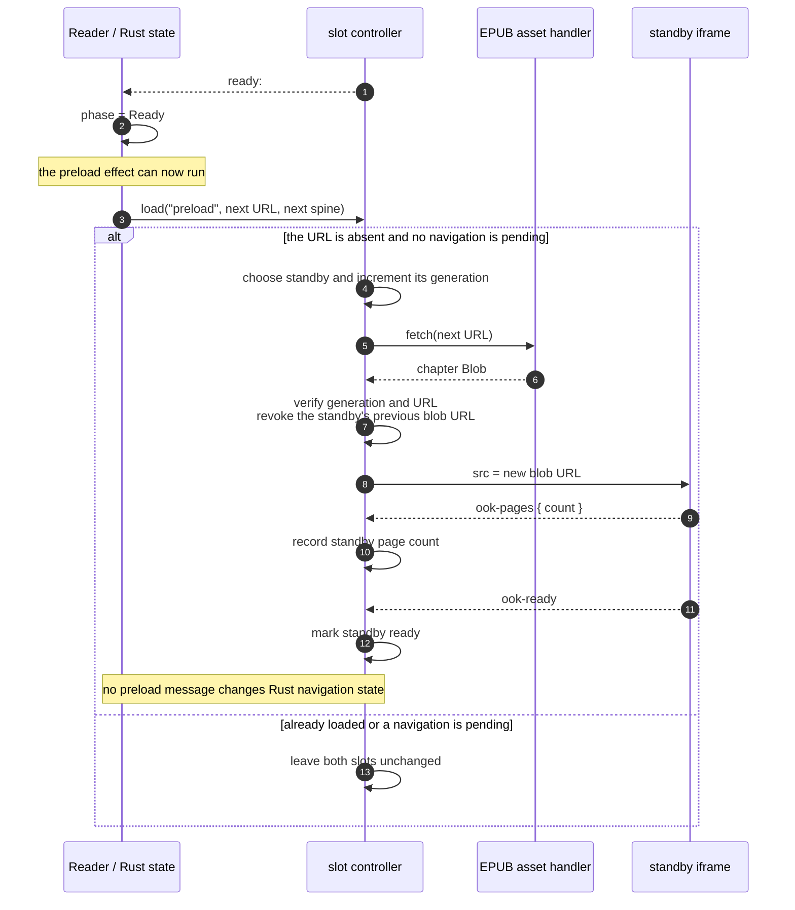
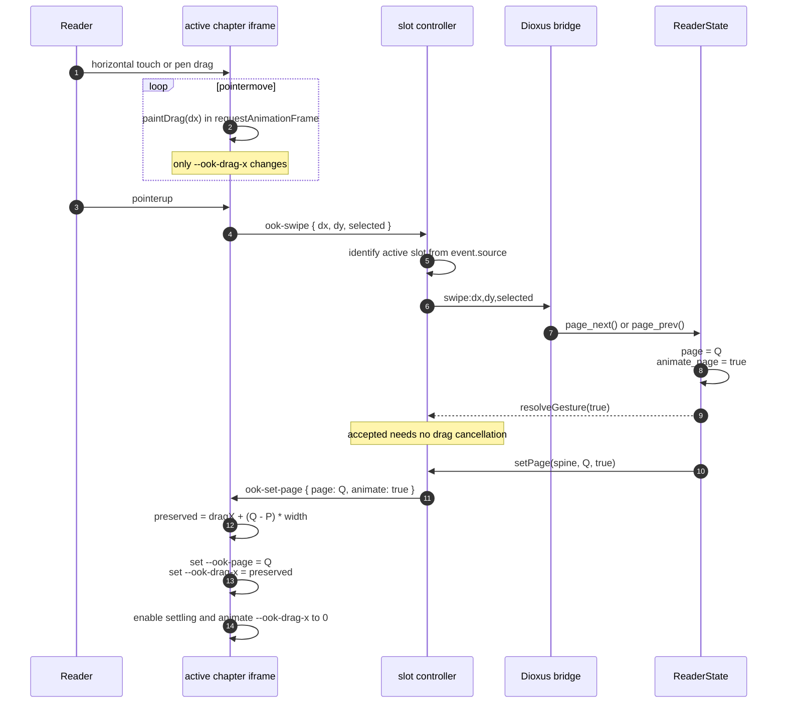
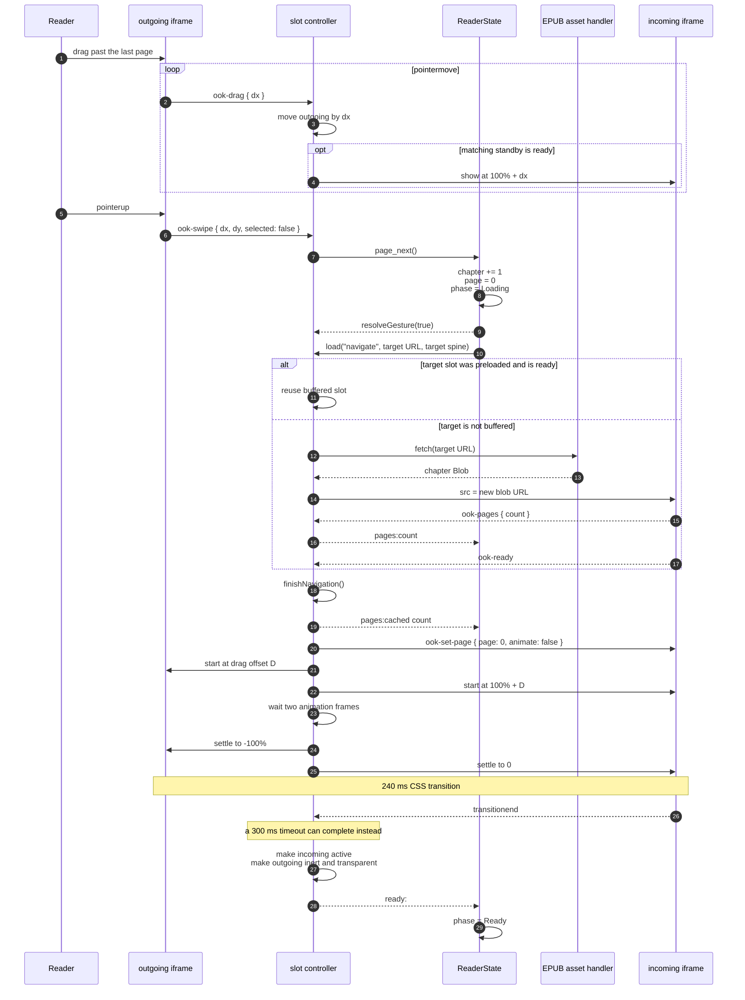
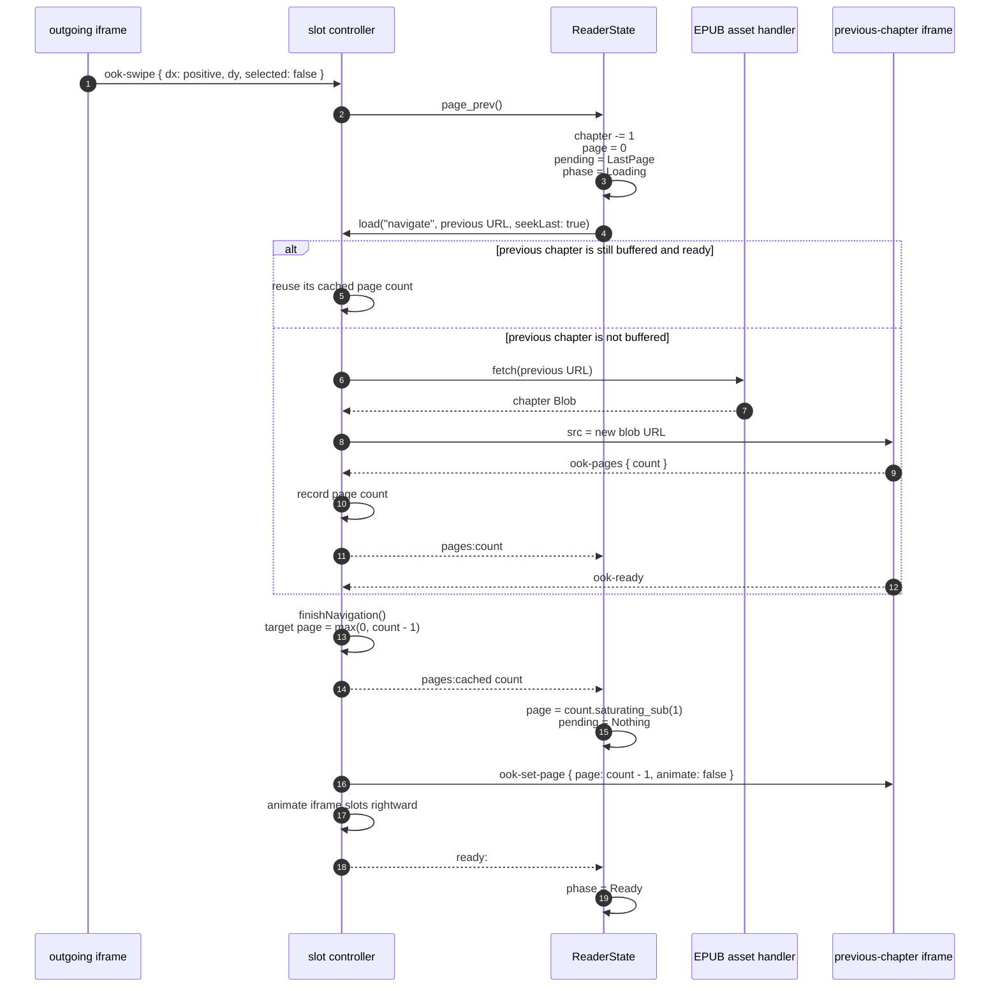
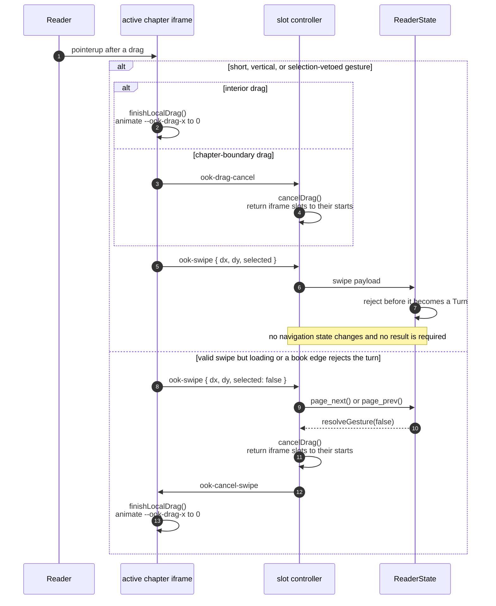
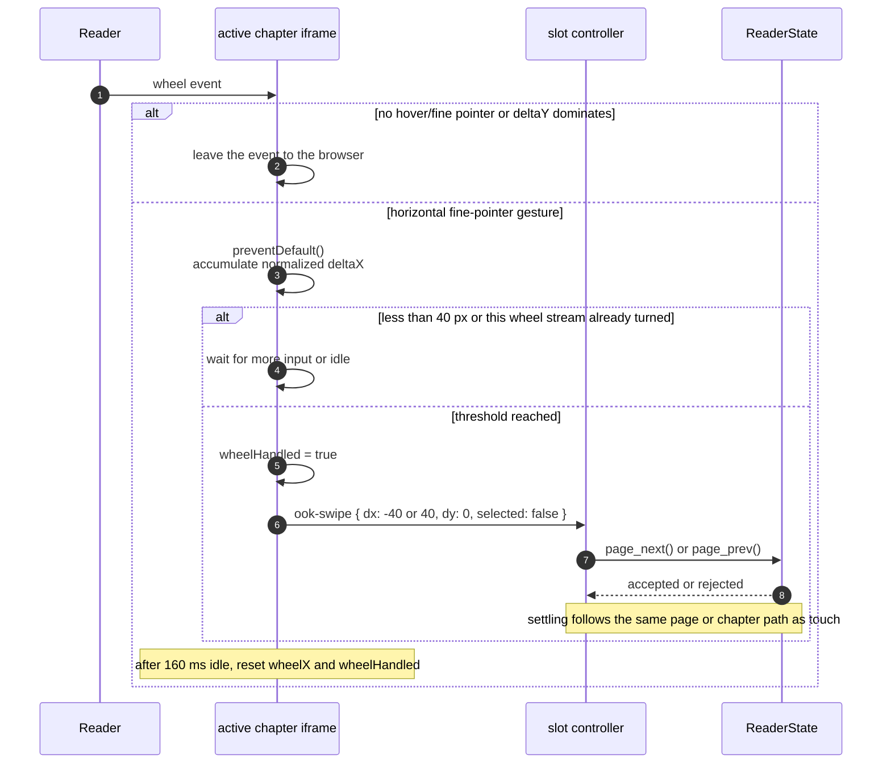

# Page transitions

This document explains how animated page turns, buffered chapter transitions, touch
swipes, and desktop trackpad gestures are implemented.

The implementation has two animation layers because an EPUB page and an EPUB chapter
have different rendering boundaries:

- Pages in one chapter are columns inside one iframe document. The chapter `body` moves.
- Chapters are separate iframe documents. Two host-level iframe slots move together.

Rust remains the source of truth for the current chapter and page. JavaScript owns
pointer-rate painting and iframe lifecycle because both must happen in the webview.

## File map

| File | Responsibility |
| --- | --- |
| [`src/nav.rs`](../src/nav.rs) | Canonical page/chapter state and navigation decisions |
| [`src/ui/reader.rs`](../src/ui/reader.rs) | Two iframe slots, Dioxus effects, bridge dispatch, gesture acceptance |
| [`assets/main.css`](../assets/main.css) | Host viewport, iframe slot geometry, chapter transition timing |
| [`reader-controller.js`](../src/web/assets/host/reader/reader-controller.js) | Slot controller, fetches, blobs, preloading, promotion, source-scoped routing |
| [`frame-bridge.js`](../src/web/assets/host/reader/frame-bridge.js) | Connects the slot controller to `dioxus.send` |
| [`blob-cleanup.js`](../src/web/assets/host/reader/blob-cleanup.js) | Revokes both slot blobs and removes the bridge listener |
| [`pagination.css`](../src/web/assets/chapter/presentation/pagination.css) | Column translation and local page-settle transition |
| [`page-listener.js`](../src/web/assets/chapter/navigation/page-listener.js) | Applies Rust page commands inside a chapter |
| [`page-count.js`](../src/web/assets/chapter/navigation/page-count.js) | Measures and exposes the chapter page count |
| [`pointer-gesture-listener.js`](../src/web/assets/chapter/input/pointer-gesture-listener.js) | Touch/pen dragging, taps, selection protection, desktop wheel gestures |

## State ownership

`ReaderData` stores the canonical navigation state:

| Field | Meaning |
| --- | --- |
| `chapter` | Current spine index |
| `page` | Current page in that chapter |
| `page_count` | Measured number of columns in the current chapter |
| `animate_page` | Whether the next `ook-set-page` should settle with motion |
| `pending` | Deferred fragment or previous-chapter last-page target |
| `phase` | `Loading` while a chapter transaction is active, otherwise `Ready` |

`ReaderState::page_next` and `page_prev` return `bool`. `true` means Rust accepted the
turn; `false` means the book edge or the loading phase rejected it. The gesture path sends
that result back to JavaScript so a rejected drag can return to its starting position.

Input is rejected while `phase == Loading`. This prevents a second turn from reusing the
standby slot during an unfinished chapter transition.

`animate_page` is enabled only for explicit page turns. Reflow, fragment resolution,
restoration, and previous-chapter last-page resolution set it to `false`, so layout
corrections snap instead of visibly sliding through unrelated content.

## Two iframe slots

`Reader` always renders two stable iframe elements:

```text
.reader-viewport
  #reader-frame-0
  #reader-frame-1
```

The viewport clips overflow. Both frames fill it absolutely, allowing either frame to move
without changing layout. JavaScript changes which slot is active instead of mounting and
unmounting iframes during each turn.

Each slot records:

```text
iframe element
blob URL
chapter URL
spine index
load generation
ready flag
page count
current page
```

Only the active slot is opaque, interactive, and exposed to accessibility. The standby is
`inert`, `aria-hidden`, transparent, and ignores pointer events until a transition uses it.

## Loading and preloading

After the first chapter reaches `Ready`, the Dioxus preload effect asks the controller to
load the next spine document into the standby slot. A two-slot design can retain only one
neighbor, so forward reading is the preload priority.

`fetchInto` performs these steps:

1. Increment the slot generation and assign the intended URL and spine index.
2. Fetch the chapter through the EPUB asset handler.
3. Read the response as a `Blob` to preserve its content type.
4. Reject the response if the slot generation or requested URL changed while awaiting.
5. Create a blob URL and revoke the blob previously owned by that slot.
6. Navigate the slot iframe to the new blob URL.

A preload does not change Rust state. Its page-count, position, and ready messages are
recorded or ignored by the host controller until that slot becomes a navigation target.

When navigation targets an already-preloaded URL, the controller reuses the ready slot. If
the target is not buffered, it fetches into the standby slot on demand while leaving the
outgoing chapter visible.

### Forward preload sequence



## Source-scoped messages

Two live iframe documents can both emit `ook-pages`, `ook-ready`, `ook-position`, and input
events. Forwarding every event would let the standby overwrite the active reading position.

The host message listener therefore passes `event.source` to `slotForSource`. The source
window, rather than a slot identifier supplied by chapter content, determines which slot
sent the event.

The routing rules are:

| Message | Active slot | Pending target | Unrelated standby |
| --- | --- | --- | --- |
| `ook-pages` | Forward when no transaction is pending | Record and forward | Record only |
| `ook-ready` | Record | Finish preparation | Record |
| `ook-scroll` | Forward | Resolve fragment, then finish preparation | Ignore |
| `ook-position` | Forward when idle | Ignore | Ignore |
| Input and links | Forward when idle | Ignore | Ignore |
| Warnings | Forward | Forward | Ignore |

The pending target cannot be promoted until it is ready. A fragment navigation also waits
for `ook-scroll`, ensuring the target page is resolved before the chapter enters onscreen.

## Same-chapter page animation

Chapter pagination is CSS multi-column layout. Each column pitch is exactly one viewport,
so page `P` has the base translation:

```text
-P * viewport width
```

Dragging adds a transient pixel offset:

```css
transform: translate3d(
  calc(var(--ook-page) * -100vw + var(--ook-drag-x)),
  0,
  0
);
```

`paintDrag` writes `--ook-drag-x` through `requestAnimationFrame`. Raw pointer moves do not
cross the iframe-to-Rust bridge, avoiding serialization and reactive-render latency.

When Rust accepts a turn from page `P` to page `Q`, `settlePage` must change the integer
page without making the content jump. If the current drag offset is `D` and viewport width
is `W`, it first preserves the visual position with:

```text
preserved drag = D + (Q - P) * W
```

It then changes `--ook-page`, assigns the preserved drag, enables the transition class, and
animates the drag back to zero. The final transform is the exact base position for page
`Q`.

A rejected or cancelled drag leaves the integer page unchanged and animates only
`--ook-drag-x` back to zero.

### Same-chapter turn sequence



## Chapter transition

At a chapter boundary there is no adjacent column in the active iframe. The host controller
therefore moves iframe slots instead of the chapter body.

Direction uses `+1` for a forward turn and `-1` for a backward turn. With an in-progress
drag offset `D`, the starting positions are:

```text
outgoing = D
incoming = direction * 100% + D
```

The settle transition moves them to:

```text
outgoing = -direction * 100%
incoming = 0
```

After `transitionend`, or a 300 ms safety timeout, the incoming slot becomes active. The
old slot becomes inert and transparent, the pending transaction is cleared, and `ready:`
allows Rust to return to `Phase::Ready`.

The CSS transition lasts 240 ms and uses `cubic-bezier(0.22, 1, 0.36, 1)`. Two nested
`requestAnimationFrame` calls separate the initial placement from the final transforms so
the browser observes both states and starts a transition.

### Forward chapter-boundary turn sequence



## Backward chapter turns

Forward navigation knows that the next chapter starts on page zero. Backward navigation
must wait for the previous chapter to report its page count.

Rust marks the target as `Pending::LastPage`. Once the target slot's page count is available,
both the host controller and `ReaderState::on_pages` resolve the target to
`page_count.saturating_sub(1)`. That page is applied without an inner page animation before
the iframe slots move.

### Previous-chapter resolution sequence



## Touch and pen input

Touch and pen pointers use direct manipulation:

1. `pointerdown` records coordinates, selection state, pointer ID, and tap timing.
2. Pointer capture keeps the gesture coherent if it crosses an element boundary.
3. Movement must exceed the 6 px visual slop and be more horizontal than vertical.
4. Interior movement updates `--ook-drag-x` locally.
5. Boundary movement posts `ook-drag` so the host can move both iframe slots.
6. `pointerup` posts the final `dx`, `dy`, and selection state to Rust.
7. Rust requires at least 40 px, horizontal dominance, and no active selection.
8. Rust returns accept or reject; JavaScript commits or settles back.

`touch-action: pan-y` leaves vertical browser gestures available while reserving horizontal
movement for page turns.

Text selection remains a veto. A selection present at pointerdown or pointerup prevents a
page turn. Tap, double-tap, and long-press timing remains separate from swipe recognition.

### Cancellation and rejection sequence



## Desktop input

Mouse drag is deliberately not a page-turn gesture. `pointerType == "mouse"` disables swipe
tracking and pointer capture, preserving ordinary click and text-selection behavior.

Desktop trackpad navigation uses `wheel` events when the environment reports both hover
and a fine pointer:

```text
(hover: hover) and (pointer: fine)
```

Only events where `abs(deltaX) > abs(deltaY)` are consumed. Horizontal deltas accumulate
until they reach 40 px, then one synthetic `ook-swipe` enters the same Rust decision path as
a touch swipe. Momentum events cannot cause additional turns until the wheel stream has
been idle for 160 ms.

Positive wheel `deltaX` maps to the next page; negative `deltaX` maps to the previous page.
Vertical scrolling and diagonal gestures dominated by `deltaY` are ignored.

### Trackpad turn sequence



## Accessibility and reduced motion

Only the active iframe is interactive and present in the accessibility tree. This prevents
screen readers from seeing duplicate chapter documents while one is buffered.

Both inner-page and iframe transitions honor `prefers-reduced-motion: reduce` by changing
the settle duration to zero. Navigation state and buffering are unchanged.

## Cleanup

Each slot owns at most one live blob URL. Reusing a slot revokes its previous URL after the
replacement fetch succeeds.

When `Reader` unmounts, `blob-cleanup.js`:

1. Calls the controller's `destroy` method to revoke both slot blobs.
2. Clears the callback used to send messages to Dioxus.
3. Removes the global frame message listener.

This keeps repeated book opens from retaining chapter bytes or duplicate listeners in the
long-lived app webview.

## Verification

The source-contract tests in `src/ui/reader.rs` pin the cross-language message names,
source-scoped slots, per-slot blobs, cancellation path, local drag variable, mouse-drag
policy, and horizontal-wheel policy.

Useful checks are:

```sh
cargo test -- --skip ui::reader::test::the_page_label_waits_for_a_real_count
cargo clippy --all-targets --all-features --locked -- -D warnings
dx build --platform desktop
dx build --platform ios
```

The skipped page-label test is an existing mismatch unrelated to transitions: the test
expects `Page ...`, while the current UI formatter returns only `...` or `N of M`.

The iOS simulator checks exercised:

- Short-drag cancellation without a page change.
- Forward and backward interior page turns.
- Forward and backward chapter-boundary promotion.
- Previous-chapter last-page resolution.
- A single active chapter in the accessibility tree.

## Constraints

- Two slots can buffer only one adjacent chapter. Forward preloading is prioritized;
  backward navigation may load on demand.
- A failed chapter fetch emits a warning but does not yet provide a retry or failed phase.
- The 40 px acceptance threshold exists in Rust and in JavaScript's local settle/wheel
  behavior. Changes must keep both sides aligned.
- The 240 ms CSS duration, 260 ms class cleanup, and 300 ms host fallback are coupled.
- Pointer-rate animation intentionally stays in JavaScript; moving it into Rust would add a
  bridge round trip to every frame.
